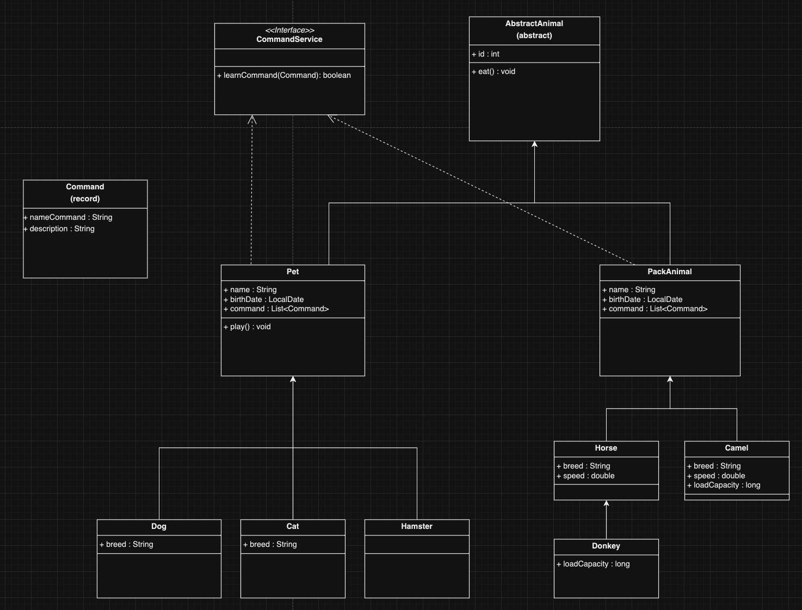

# Final test, 2024

## Информация о проекте

Необходимо организовать систему учета для питомника, в котором живут домашние и вьючные животные.

## Задание

### 1. Работа в операционной системе Linux Ubuntu
    1.1 Создать два файла Pets и PackAnimals
        - заполнить файлы в соответствии с типами
        - объединить содержимое файлов в файл Human Friends
        - создать директорию и переместить туда Humam Friends
    1.2 Подключить дополнительный репозиторий `MySQL`. Установить любой пакет из этого репозитория  
        - установить и удалить `deb-пакет` с помощью `dpkg`
> Команды представлены в файле [*linux.txt*](linux.txt)

### 2. Работа с MySQL
> Скриншоты таблиц представлены в директории [sql_tables_images](sql_tables_images)
> 

Создаем таблицы с иерархией из диаграммы в БД:

```sql
create table AnimalTypes
(
    id int auto_increment primary key,
    name varchar(50)
);

create table Pets
(
    id int auto_increment primary key,
    name varchar(50),
    type_id int,
    birthdate date,
    commands varchar(200),
    foreign key (type_id) references AnimalTypes(id)
);

create table PackAnimals
(
    id int auto_increment primary key,
    name varchar(50),
    type_id int,
    birthdate date,
    commands varchar(200),
    foreign key (type_id) references AnimalTypes(id)
);

insert into AnimalTypes (name) values ('DOG');
insert into AnimalTypes (name) values ('CAT');
insert into AnimalTypes (name) values ('HAMSTER');
insert into AnimalTypes (name) values ('CAMEL');
insert into AnimalTypes (name) values ('HORSE');
insert into AnimalTypes (name) values ('DONKEY');

insert into Pets (name, type_id, birthdate, commands) values ('clay', 1, '2015-04-13', 'sit, stay, fetch');
insert into Pets (name, type_id, birthdate, commands) values ('chopick', 2, '2022-08-01', 'paw');
insert into Pets (name, type_id, birthdate, commands) values ('smack', 3, '2023-01-10', 'roll, hide');
insert into Pets (name, type_id, birthdate, commands) values ('grusha', 1, '2011-12-25', 'sit, paw, bark');
insert into Pets (name, type_id, birthdate, commands) values ('stephan', 2, '2024-01-01', 'jump');

insert into PackAnimals (name, type_id, birthdate, commands) values ('layla', 5, '2020-07-19', 'canter, load');
insert into PackAnimals (name, type_id, birthdate, commands) values ('bogdan', 4, '2022-03-27', 'load');
insert into PackAnimals (name, type_id, birthdate, commands) values ('parsifal', 6, '2023-01-10', 'walk, sit');
insert into PackAnimals (name, type_id, birthdate, commands) values ('frida', 5, '2019-12-25', 'gallop, canter');
insert into PackAnimals (name, type_id, birthdate, commands) values ('simon', 6, '2021-05-08', 'walk, load');

create table adult_animals_1_to_3_years
(
    id int auto_increment primary key,
    name varchar(50),
    type_id int,
    age varchar(100),
    commands text
) select 
	   name, 
	   type_id, 
	   concat(timestampdiff(year, birthdate, curdate()), '.',
	   timestampdiff(month, birthdate, curdate()) % 12) as age,
       commands
from 
	Pets
where 
	timestampdiff(month, birthdate, curdate()) / 12 between 1 and 3
    
union all

select name, 
	   type_id, 
	   concat(timestampdiff(year, birthdate, curdate()), '.',
	   timestampdiff(month, birthdate, curdate()) % 12) as age,
       commands
from 
	PackAnimals
where 
	timestampdiff(month, birthdate, curdate()) / 12 between 1 and 3;     

create table combined_tables_dbHumanFriends
(
    id int auto_increment primary key,
    name varchar(50),
    type_id int null,
    age varchar(100) null,
    commands text null,
    source_table varchar(50)
) select name, type_id, birthdate as age, commands, 'Pets' as source_table 
  from Pets
  union all
  select name, type_id, birthdate as age, commands, 'PackAnimals' as source_table 
  from PackAnimals
  union all
  select name, type_id, age, commands, 'adult_animals_1_to_3_years' as source_table 
  from adult_animals_1_to_3_years
  union all
  select name, id as type_id, null as age, null as commands, 'AnimalTypes' as source_table
  from AnimalTypes;
```
### 3. Java OOП